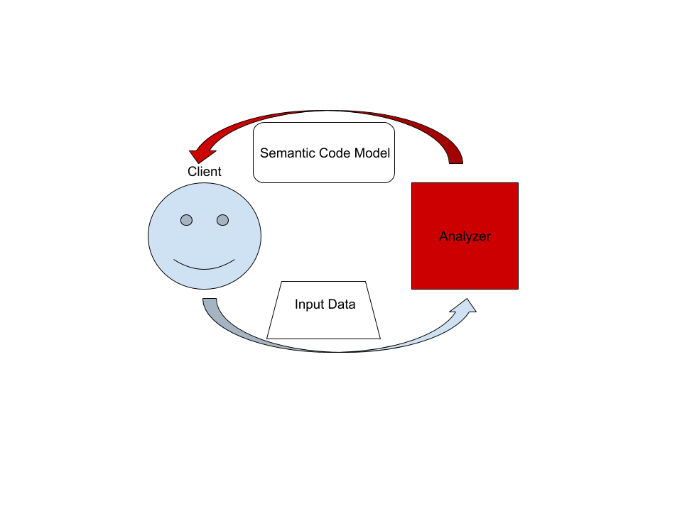

# Individual Journal: Saeid Albouyeh

***

### Date: 2026-04-18

### Period: 8

### Cooperators
* Abdullah Rezaei

### Objectives
* **Group Organization:** Dividing tasks among group members
* **Rust language essentials:** The core concepts of the Rust language and syntax
* **Understanding the project:** The subject of the project and its use cases
* **The repository structure:** The organization of the project
* **Finding tools for required analyses:** Understanding which information we need and how to gather it

### Activities & Effort
* [x] Organizing the group: Part of the group will work on design and the other part will work on architecture
* [x] Getting familiar with Rust: Rust has a special syntax and a steep learning curve; it does not follow traditional OOP principles, and there are no classes or traditional interfaces. Instead, it handles them in a different way. It also uses the Cargo tool for package management
* [x] Overview of the project: rust-analyzer is a language server that provides different services such as code completion and syntax checking; it can be used anywhere that an LSP (Language Server Protocol) is required, such as code editors which support LSP 
* [x] Overview of the structure: The code is mostly located in the crates directory; each crate represents a package. Required external libraries are listed in Cargo.toml
* [x] Finding Tools: For some of the required information (such as lines of code and number of packages), the source code must be analyzed. For other parts (such as coupling in changes), the Git history must be analyzed

### Report
Work was organized by splitting responsibilities among group members to focus on design and architecture. Project documentation and the rust-analyzer structure were studied, with a focus on the organization of crates and the Language Server Protocol. The essentials of the Rust language were examined, specifically how it eschews traditional classes, interfaces, and inheritance in favor of structs and traits to achieve composition. For the required metrics, various analysis tools were evaluated; cloc and scc were checked, with scc ultimately being chosen for the task. Finally, the analysis process was supported by the use of Code Mate in conjunction with specific Linux bash commands.

***