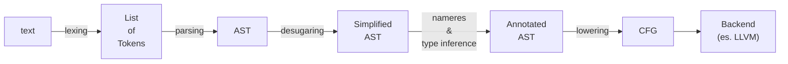

# Architectural notes
These are some of my personal notes on how some components work, taken mostly from this [palylist](https://www.youtube.com/playlist?list=PLhb66M_x9UmrqXhQuIpWC5VgTdrGxMx3y):

## VFS + Paths
Rust Analyzer uses a virtual file system to abstract away how files are actually stored in the file system.
This is done for several reasons:
1. Rust Analyzer, to avoid occupying too much memory, has to be able to create derived data, forget about it and then recompute it again. Rust Analyzer is therefore mostly concerned with storing stable, versioned snapshots of file contents, so that the analysis can be incremental and deterministic. 
2. Rust Analyzer wants to be *platform-agnostic*, it should be able to work regardless of the underlying file system used by the OS. The VFS helps decouple the internal representation of files from how the OS keeps track of them. Only specific submodules (`loader`) know actual OS paths.
3. On a similar vein, Rust Analyzer would also like to be able to support Multi-file system works (for example, projects written on a Windows machine, but analysed on a separate Linux server).

For Rust Analyzer is much simpler to create an internal representation of files as text snapshots indexed by `FileId`, removing direct dependence on OS paths and file system semantics.

To achieve this, files are stored identified not by their paths, but through an ID, called `FileId`. 

> **Architecture Invariant** 
> Using IDs to identify files has another important consequence: it makes it very hard to go from a `FileId` to an actual file on the OS file system.
> This makes it easier to avoid mistakes where a developer accidentally reads a file directly and causes problems.
> This way, access to files happens strictly through the *virtual file system*.  
>
> This trend is visible throughout this whole component, file system specific information is systematically erased and only the virtual representation is available to the rest of the project.

> **Architecture Invariant**
> VFS doesn't perform any IO directly and doesn't load or read files, its job is only to record state. The VFS is updated through events such as `set_file_contents`, which in turn updates the `changes` array.
>
> It's instead `loader.rs` job to perform the actual read of the file. It is both able to read files and detect when they have been changed (and emit the associated events). The 'watching' functionality is a non-trivial issue to solve, as most raw OS APIs don't offer a reliable mechanism to detect changes. The crate `vfs_notify` is an implementation of `loader::Handle` and implements the file watching function.
>
> The file watching bits here are untested and quite probably buggy. For this reason, by default Rust Analyzer doesn't watch files and relies on editor’s file watching capabilities instead.

`FileSet` is a special module that allows VFS to be split into "chunks" that roughly correspond to single crate. This is quite useful because it allows to prevent the propagation of changes across the whole VFS, thus help limit recomputation by grouping related files. 

## IDE crate
Main facade for the language server. It provides a stable, query-based API over the semantic layer. It also converts rich semantic data structures used internally into simpler data structures which can be more easily serialized as well as implementing IDE features such as completion, hover, ….

> **Architecture Invariant**
> This crate acts as an **API boundary** between the IDE functions and the underlaying semantic representation of rust code.  

This crate internally is divided into two main subcomponents.

The `AnalysisHost` component is an abstraction used to store the current state of the analysis. It holds the mutable salsa database. Its state changes only through the invocation of a method called `apply_change`.

In this context, a `Change` represents a batch of updates to the database inputs, including file contents, source roots, and the crate graph. 

`AnalysisHost` produces `Analysis` values, which are immutable snapshots of the database at a specific point in time. These snapshots allow concurrent read access to the analysis.

> **Architecture Invariant** 
> `Analysis` provides a consistent view of the world at a moment in time. Multiple `Analysis` instances can coexist and be used concurrently. When `AnalysisHost::apply_change` is invoked, the database is updated and previously in-flight computations may be cancelled, ensuring that outdated results do not propagate.

## Rust Analyzer → main loop
The main function initiates the LSP server and creates a connection between the IDE and Rust Analyzer. Subsequently, it enters the main loop where it starts processing events.
Internally, Rust Analyzer uses *channels* to route messages between components.

This crate also defines one of the largest structs in the project: `GlobalState`. 
This struct is responsible for keeping track of:
- `analysis_host`, which holds the current logical analysis of the code.
- `req_queue` tracks in-flight LSP requests and responses, mapping request IDs to their associated state and enabling Rust Analyzer to correctly match responses to requests.
- `task_pool`, is essentially a thread pool responsible for managing the async processes that are going on in the background and reporting back their completion to the main loop.
- `sender`, used to send outgoing LSP messages to the client, as the LSP protocol is *symmetric* (i.e. both the server and the client can send request/response messages). 
- `loader`, a reference to the `vfs` loader, used to implement file watching.
- `mem_docs` stores in-memory versions of files that have been edited but not yet saved. These override the corresponding files in the VFS, ensuring that analysis always reflects what the user currently sees in the editor rather than what is on disk.
- `vfs` is used to track the virtual file system state. 


Rust Analyzer's main is essentially an event loop.
- `next_event` retrieves an event to process from one of 4 possible queues: the LSP message queue, the task pool (i.e. completed background task), the VFS and finally from cargo check.
- `handle_event` mutates the global state and processes the retrieved event.

> **Architecture Invariant** 
> Interestingly, `handle_event`, when dealing with `Event::Vfs` initiates a loop. When a task ends it immediately tries to drain additional `Event::Vfs` events from the event queue, thus allowing to coalesce many VFS events into a single loop turn.
>
> Coalescing `Event::Vfs` enables to create a single `AnalysisHost::Change` and apply changes to the analysis host in bulk.


> **Architecture Invariant** 
> Rust Analyzer informally uses the idea of "subscriptions" to limit work such as diagnostics. Since LSP does not provide a notion of visible files, it approximates this by using open (in-memory) documents (`mem_docs`) and prioritizing diagnostics for those files.

---

## CrateGraph
`CrateGraph` was one of the earliest design decisions which differentiates Rust Analyzer from a typical compiler. 
`CrateGraph` addresses a key problem of traditional compilers. Traditional compilers work on what is known as a single *compilation unit* at a time. Basically, the compilation of each crate is independent and can happen in parallel. Most importantly, a compiler needs only to analyse *downstream dependencies* and can rely on previously built data.
In an IDE environment, like the one Rust Analyzer aims to support, support for cross-crate queries is needed (e.g., “find all usages of this symbol across the workspace”)

For instance, let's assume the following situation:

```rust
// crate_a
pub struct S;

// crate_b
use crate_a::S;

fn f(x: S) {}
```
In order to provide a usage list of `S`, Rust Analyzer must search across all crates that depend on `crate_a`, and not just within `crate_a`.

> **Architecture Invariant** 
> For this important reason, Rust Analyzer doesn't think in terms of *current working directory* or *current crate*, but instead as a **set of crates** and a set of **source roots**.

The `CrateGraph`, as the name implies is a *graph*: each node is a *crate* and each node holds a vector (`Dependency`) with all other crate dependencies (stored as `crate_id` and `name`).

> **Architecture Invariant** 
> Due to how *Cargo*'s build system works, crates, while possessing stable identifiers, don't actually have a globally unique name. The actual crate's name, rather, is assigned only to the edge connecting two dependent rust crates. Practically, this means that the same crate may be referred to by different names depending on the dependency context.
>
> This prevents having a global namespace and the associated naming conflicts. It also allows different crates to include different versions of the same crate.

> **Architecture Invariant** 
> `CrateGraph` is *guaranteed* to be acyclic. A depth first search is used during the construction of `CrateGraph` to detect cycles and if found, the creation of `CrateGraph` results in an error.

> **Architecture Invariant** 
> The abstraction provided by `CrateGraph` is a deliberate choice in order to decouple Rust Analyzer from the specific build tooling used (mainly cargo). For this reason `CrateGraph` provides its own definition for some concepts present in cargo. Most importantly, some aspects are simplified. For example, "features", a cargo concept, are not present directly in `CrateGraph`, but are lowered into `cfg` style representation.

---

## Base Database Crate
This crate defines an incremental in-memory database for Rust Analyzer. Most importantly it defines important types, such as `CrateGraph`, `SourceRoot`, inputs to change the state of the world and a set of queries for reading the current state.

Recall that:
- `CrateGraph` is a graph the represents crates and their dependencies amongst each other.
- `SourceRoot` groups files into logical sets (roughly matching with crates).

> **Architecture Invariant** 
> Inputs modifications are encapsulated in the type `Change`. This struct represents a valid state of the world and can be used to describe the delta between two valid states. 
> It tracks:
> - A list of `SourceRoot` (this only happens when adding/removing files).
> - The list of file changed (with their contents).
> - A `CrateGraph`.
>
> Each field in `Change` overrides the corresponding values in the database through the `apply`.

This crate is the glue that keeps Rust Analyzer working well; it offers an interface to store Rust Analyzer specific concepts in a procedural incremental database implemented using `salsa` crate.

What makes salsa grate in this use case is that it allows to create essentially to discover and track the dependencies between queries and recompute them incrementally on demand when inputs change.

In Rust Analyzer queries are defined as trait methods with Salsa macros. Some are marked as *inputs* while others are *derived queries*.

> **Architecture Invariant** 
> There are actually two separate databases implemented as `trait`s: `SourceDatabase` (compiler specific needs) and `SourceDatabaseExt` (IDE specific needs).
> This is a strict design choice to prevent the compiler from seeing IDE-specific data.

> **Architecture Invariant** 
> A `Change` is a structure that can fully describe a valid state of Rust Analyzer.
> This property becomes quite useful when defining *fixtures* for testing and debugging purposes: the developer can define a valid state through a fixture (as string) and have it converted to a `Change` to initialize Rust Analyzer in a known and reproducible state.


As Rust Analyzer works with multiple crates at the same times, and has no concept of a "current crate", it needs to determine which crates are relevant for a given file.
This is handled via queries such as `relevant_crates`, which approximate the set of crates a file may belong to based on its source root.
This is necessary because some files may not be part of the `CrateGraph` yet, but still need to be placed inside a valid context to provide useful information.

> **Architecture Invariant** 
> Salsa by default keeps a global version of the database which it increments every time an input changes. This is used to determine whether the cached value is still valid or not.
>
> This is effective, but quite coarse as some inputs are sometimes marked as stale even though nothing of relevance actually changed.
>
> For this reason, Rust Analyzer introduces `Durability::HIGH` and `Durability::LOW` inputs.
>
> Low durability inputs (e.g., user code) only invalidate queries that depend on low durability data, while high durability inputs (e.g., standard library or dependencies) invalidate all queries.
>
> This allows Salsa to avoid revalidating large portions of the query graph (such as dependencies) when only frequently changing inputs are modified.

---

## Syntax Overview
The crate `syntax` provides an API for interacting with Rust Analyzer syntax trees.
The underlying implementation is split across multiple crates: the `parser` crate implements Rust grammar and parsing, while the `rowan` library provides the underlying lossless syntax tree infrastructure used by the `syntax` crate.

This crate is of particular significance, as it deviates from the standard implementation of a compiler pipeline commonly found in textbooks.
A compiler designed to work for an IDE has different needs than a traditional compiler. The former is not as much as a "solved" problem as the latter.

Generally, a typical compiler pipeline can look like this:



Notice that the transformation is strictly one way and is inherently lossy. The compiler also doesn't need to know much about the original text.
The only information that is needed is to know the position of the different spans to provide diagnostics and error messages.

An IDE, on the other hand, requires the transformation to remain reversible; features like code actions, auto imports and quick fixes, need to recover information about the text that generated them in order to work.

Additionally, the parsing and compiling chain in an IDE needs to be able to deal with broken or incomplete code in order to be able to provide useful actions to the user.

An aspect that shows this dichotomy quite well is that compilers don't care about white spaces or comments, whereas many IDE functionalities rely on them.

The main entry point is `SourceFile`, the root node of any AST tree built using Rust Analyzer, as it represents a source rust file. Parsing of a source file is achieved through the methods `SourceFile::parse()`, which returns a `Parse<SourceFile>` object containing both syntax tree and potential syntax errors. 

> **Architecture Invariant** 
> There are a couple of important differences between a traditional compiler parser and an IDE parser.
> First, as mentioned before, the CST built by Rust Analyzer is a *lossless* CST, and contains every bit of information from the original text. The AST is implemented as a typed wrapper over the CST.
> It's possible to move back and forth between CST and text representation.
> Moreover, an IDE needs to keep on working even with incorrect code and should not try to repair it on the fly (like a traditional compiler) as it's key that missing elements remain so in order to provide accurate feedback on the source text. AST nodes are specifically designed to be able to handle possibly missing fields.
> Because of this, the method `SourceFile::parse()` *always* returns a `Parse` with a syntax tree and a list of errors, rather than `Result<Ast, SyntaxError`.  
>
> This choice also influences diagnostics as they are lightweight compared to compiler diagnostics. 
> Rust Analyzer assumes a different workflow, where fast incremental feedback is often more important than producing highly sophisticated error messages.


> **Architecture Invariant** 
> AST nodes are intentionally shallow wrappers over syntax nodes. This allows to provide a typed view of the CST that is resilient to missing or incomplete data. The different components of each syntax node can be accessed through a series of getter methods return an `Option<_>`.

The `syntax` API provides a method for quickly switching between a typed AST to an untyped CST, by calling the method `ast::syntax()`. 
To move from a CST to an AST, you can call the method `ast::Expr::cast()` 

Each syntax node keeps track of:
- Its `kind`, a C style enum that identifies the "type" of node.
- The text range.
- A view over the corresponding source text.

This crate also provides an API for different traversal methods acting on AST trees, such as `parent`, `children`, `children_with_tokens`, `siblings`, `ancestors`, `descendants`, `preorder`.


