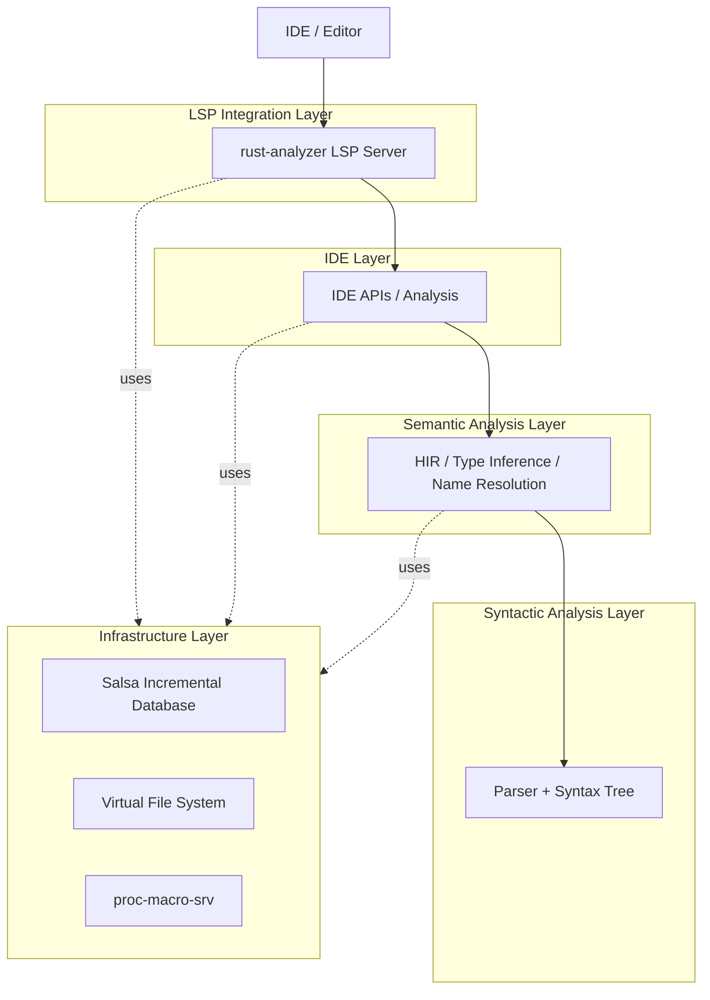
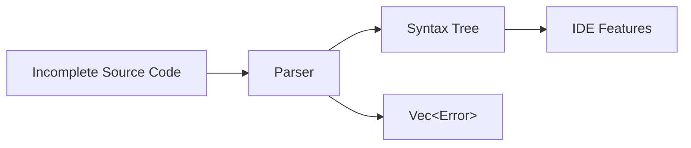
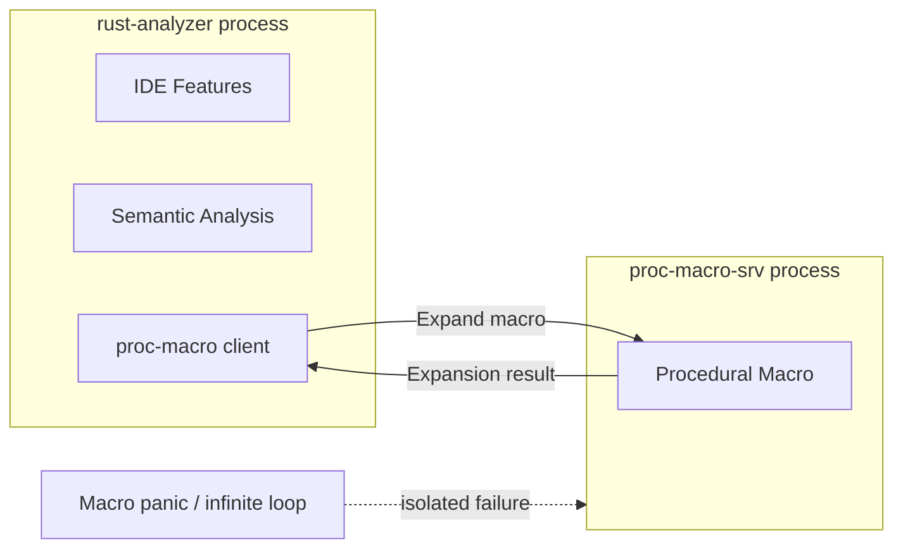
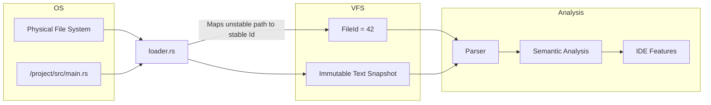
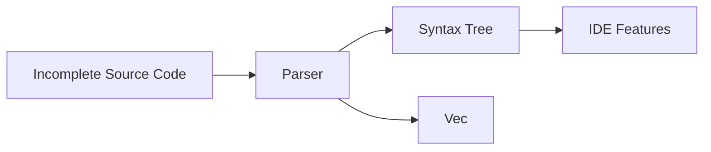
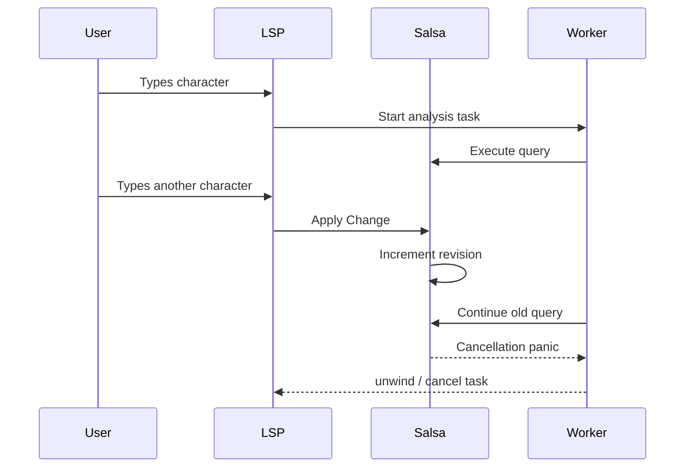

# Architecture
<!--
- Primary goal: document and describe the architecture of the system
- Use C4 notation, provide levels 1-2-3:
    - Declare the tool(s) used for C4 diagram
    - Context diagram
    - Container diagram
    - Components diagrams (motivate decisions if you may need to discard specific containers)
- Tooling
    - https://c4model.com/tooling
    - indicate what you used in the report
- Max 2500 words, excluding diagrams
-->

## Introduction
The rust-analyzer project is structured using a **compiler-as-a-library** architectural pattern. It operates as a collection of modular libraries working together to provide structured syntactic and semantic analysis of Rust source code. However, it is important to highlight that the crates within the `crates/` directory form an internal architecture; they are not published as independent tools and are not intended for external use.

<!--
Note from Marco Oliviero:
I'm not sure about this part, because as we discovered recently, the majority of the crates are not intended for external use.
Cfr:
    Published Library Crates: Three crates in lib/ are published to crates.io as independent libraries

    Internal Crates: All crates in crates/ have version 0.0.0 and are not intended for external use. They form rust-analyzer's internal architecture and can evolve freely without backward compatibility constraints

    link: https://deepwiki.com/rust-lang/rust-analyzer/2.1-crate-structure-and-dependencies
-->

In this analysis we focused our attention on what is probably the most common use case for rust-analyzer: a user interacting with rust-analyzer through an IDE to obtain language tooling features (such as code completion, type checking, error checking, goto-definitions, … ).

To support this highly interactive environment, rust-analyzer relies on a loosely layered architecture where each internal layer exposes a clear API boundary and builds on top of lower-level abstractions. This decoupling allows the system to utilize internal components in isolation. By combining these modular pieces, the architecture successfully achieves the fast, incremental computation required for responsive IDE features.

## Context level
<!--
- Context level: diagram and explanations
-->

As mentioned in the introduction, rust-analyzer's core workflow consists of a user asking its IDE for some language tooling feature. The IDE then forwards this request to rust-analyzer using the LSP protocol.

<figure>
    

        
        <figcaption><em>Figure 1.1: System context diagram</em></figcaption>
    

</figure>

> "The Language Server Protocol (LSP) is an open, JSON-RPC-based protocol for use between source-code editors or integrated development environments (IDEs) and servers that provide 'language intelligence tools'. The goal of the protocol is to allow programming language support to be implemented and distributed independently of any given editor or IDE."
> 
> \- *Wikipedia*

***

## Container Level
<!--
- Container level: diagram and explanations
    * Did you find any relationship with the Clean Architecture blueprint?

Salsa apparently shouldn't be considered a container, as it's not a database running as a separate process, but rather a logical component that implements incremental persistance.
-->

At the container level rust-analyzer's layered architecture is not yet visible, though some of the most important entities start to emerge.

The external IDE interacts directly with the language server exposed by rust-analyzer's single deployed container.

<figure>
    

        
        <figcaption><em>Figure 2.1: Container diagram</em></figcaption>
    

</figure>

Although we won't delve into its specifics, as it doesn't concern the runtime system, `xtask` is rust-analyzer's custom build tool; it is able to produce different types of rust-analyzer binaries, and it's used extensively in development to produce builds with different characteristics (testing, profiling, …).

As rust-analyzer is a single deployable unit, the clean architecture blueprint is not yet clearly visible at this level of abstraction.
However, rust-analyzer's designers were clearly aware of "clean code" and "clean architecture" approaches as it will become more apparent in the next section.

***

## Component Level
<!--
- Component level: diagrams and explanations
    * Did you observe any violation of SOLID principles at level 3 ?
-->
At the component level, rust-analyzer can be understood as a loosely layered architecture organized around four conceptual layers: LSP integration, IDE services, semantic analysis, and syntactic analysis. These layers are supported by a shared infrastructure layer that provides incremental computation, file abstraction, and external process isolation. Rust-analyzer also provides services that handle cargo project management, profiling tools, conditional build support and interning functions. Figure 3.1 shows the full component diagram of rust-analyzer.

<figure align="center">
        
        <figcaption><em>Figure 3.1: Component diagram</em></figcaption>
</figure>

As Rust-analyzer's project implements a great number of crates, we decided to group crates that lie behind a common API boundary. 
For example, the `ide` crate defines an API boundary, part of which is implemented by the subcrates `ide-db`, `ide-assists`, `ide-completion`, `ide-diagnostics` and `ide-ssr`.
Similarly the API boundary defined by the `hir` crate is partially implemented by the subcrates `hir-expand`, `hir-def` and `hir_ty`.
<!--
    division of crates proc-macro-api, proc-macro-srv, proc-macro-srv-cli
    division of vfs and vfs-notify
-->

one last example could be which has subcrates `proc-macro-api`, `proc-macro-srv` and `proc-macro-srv-cli`.

However, as rust-analyzer is quite complex, we will focus our analysis on the conceptual layers we identified, while glossing over some of the more implementation-specific details or project related crate management. Below there's a diagram that highlights the core components of our analysis, while omitting some implementation complexity.

### Core information flow

The system can be modelled as a series of pipes and filters, where information gradually flows through layers. In practice while requests flow downward from LSP to syntax, most layers also interact directly with shared infrastructure services such as incremental computation and file management, bypassing strict hierarchical constraints and qualifying this architecture as loosely layered.

### Boundaries

A detailed analysis of rust-analyzer revealed the presence of several explicit domain boundaries, further strengthening our claim of rust-analyzer's layered architecture.  

Starting from the lowest level, the `syntax` crate makes up the first boundary.
This crate defines a clear API for handling the conversion from text to a lossless syntax tree.
Crucially, it knows nothing about the underlying infrastructure and is unaware of concepts like salsa or LSP.
This clear separation of domain concepts, allows the `syntax` crate to evolve independently of the other components of the system. 

When we increase the level of abstraction, we encounter another API boundary in the `hir` crate. This component defines an API that wraps the internal ECS-style internal API into a more *object-oriented* flavoured API, thus hiding implementation details to the other users of this crate.

On top of `hir`, the `ide` crate defines another important boundary.
This crate acts as a façade for interacting with analysis tools, and provides the key abstractions employed by rust-analyzer in the form of `Analysis` and `AnalysisHost`.

Finally, the outermost API boundary is represented by the `rust-analyzer` crate. This crate acts as an *anti-corruption layer* and is the bridge that connects the outside domain model (LSP driven interaction) to the internal domain representation. 

### SOLID Principles

When analysing rust-analyzer under SOLID's design philosophy, it's crucial to keep in mind that Rust is not a classic OOP language.
Solid principles were originally formulated in a very different context, and it's main subject of study were languages heavily based on inheritance and subtype polymorphism.

Rust follows a different design philosophy as it favours composition, algebraic data types, and trait-based abstractions over classical inheritance.
Because of this, some SOLID principles aren't directly applicable, and are often reinterpreted through traits, modular boundaries and composition patterns. 

However, an analysis of rust-analyzer through these lenses can still be insightful.

Generally the SRP principle is followed throughout the project. 
The majority of modules have a clear intent and focus.
For example, many concepts are intentionally separated, such as `AnalysisHost` vs `Analysis` (state mutation vs immutable state snapshot), `vfs` vs `vfs_notify` (current state tracking vs I/O and file system watching) and `parser` vs `syntax` (grammar vs typed CST/AST wrapper).

Given the modularity of the system, the OCP is mostly followed as well. For example, the most likely sources of changes (the language itself, and the LSP protocol, as highlighted in the [design](./Design.md) document) have been clearly separated into their own section with their own modules. This helps prevent common sources of change from affecting more stable parts of the system (such as the infrastructure). 
Additionally, its query-based architecture (via Salsa) allows for new IDE features to be added by introducing new queries rather than modifying existing computation logic.
However, it is not strictly followed in all layers, since core structures (e.g., `CrateGraph`, `AnalysisHost`, or syntax abstractions) require intervention when the language or performance requirements evolve, thus reducing the ease of extendibility.

DIP is followed at the boundary layer, with all components referencing the top level APIs defined by other components.
This is evident in components such as `vfs` and the Salsa-based database layer, where higher-level IDE logic operates over `FileId` and virtual file abstractions. Actual file system I/O operations are delegated to `loader.rs` which defines abstraction traits for file loading and watching. The concrete implementations are provided by `vfs_notify` instead. This enables higher-level logic to remain independent of platform-specific I/O concerns.
Additionally, incremental computation is expressed through abstract query traits rather than concrete data manipulation.

LSP is less directly applicable in rust, since Rust doesn't have classic subtype hierarchies, unlike OOP languages. In practice, rust-analyzer’s small, focused traits and explicit module boundaries make substitutability issues relatively uncommon. And we couldn't find any concrete example of a violation of this principle.

Finally, the ISP principle can be found in different aspects, like the decision to split the database in two separate interfaces (`SourceDatabase` and `SourceDatabaseExt`) to hide information where not relevant. Many of the components mentioned in the SRP section elicit an ISP friendly behaviour, as the interface they provide is relatively narrow.
Additionally, given rust's traits, the language itself encourages writing small interfaces that can be combined to achieve more complex behaviour. 
Due to the design, top level API boundary components inevitably end up providing quite fat API, though it's difficult to consider this fact an error on rust-analyzer's team part, given the advantages a clear API boundary provides.

***

## Architectural characteristics
<!--
- Architectural characteristics: comment on important architectural characteristics/qualities of the system and how they are supported by the architecture
    * You might also use components coupling and cohesion metrics to support your reasoning
-->

### Robustness and Fault Tolerance

Rust-analyzer works in an environment that is significantly different from that of a traditional compiler and has to face different challenges. For instance, in an IDE scenario the source code is often at least partially invalid and highly dynamic. Rust-analyzer needs to be able to provide language tooling features even when it processes incomplete or malformed inputs as well as internal failures. It also needs to abort ongoing analysis, to avoid providing results computed over stale data.  

In order to achieve this, rust-analyzer employs the following architectural strategies:
- **Non-destructive parsing**: the `syntax` crate, rather than returning `Result<T, Error>`, provides `(Tree, Vec<Error>)`. This way parsing never fails even in the presence of errors. The AST is always generated, even with error nodes, and the semantic layer can still provide useful features like *code completion*.

- **Graceful cancellation**: whenever a user types a new character, any background process currently analysing stale code needs to be stopped. The `salsa` database enables this functionality by keeping track of a revision counter, which is increased whenever the underlying data is modified. This change in revision counter causes background threads to panic, while the outer LSP boundary handles these events using `catch_unwind`. Panics are then transformed into graceful cancellation responses for the IDE, preventing the system from crashing while still freeing up CPU resources immediately.
- **Isolated macro expansion**: Rust enables its users to write procedural macros, which execute custom, third-party code during compilation. Unfortunately poorly written macros can cause infinite-loops or panic. In order to keep the language server responsive, rust-analyzer delegates macro expansion to an entirely separate OS process (`proc-macro-srv`). This creates a strict fault-isolation boundary: if a macro crashes, only the child process dies, while the main rust-analyser remains receptive to new inputs.

<em>Rust-analyser's simplfied separate macro expansion system.</em>

### Portability and Determinism

Rust-analyzer uses a *virtual file system* (VFS) to abstract over how files are actually stored and accessed by the host operating system.

This abstraction serves several purposes:

- **Files as immutable snapshots:** Rust-analyzer is designed around *incremental recomputation*. To keep memory usage manageable, it frequently derives intermediate analysis data, discards it, and later recomputes it on demand. The system is therefore primarily concerned with maintaining stable, versioned snapshots of file contents rather than long-lived mutable file handles or direct interaction with the OS file system. Treating files as immutable snapshots allows analysis results to be recomputed deterministically and cached incrementally.
- **Platform agnosticism**: Rust-analyzer aims to remain as platform-agnostic as possible. Different operating systems expose different file-system semantics — path normalization rules, symbolic links, case sensitivity, file watching APIs, and so on. The VFS isolates these concerns behind a uniform interface, so that most of the codebase operates on a platform-independent representation of files. Only a small portion of the system (primarily the `loader` module) interacts directly with OS paths and native file-system APIs.

Internally, rust-analyzer represents files as text snapshots indexed by identifiers called `FileId`s, rather than by raw paths. This design greatly simplifies the architecture: paths are inherently unstable and OS-dependent, while numeric identifiers are compact, immutable, and cheap to compare, hash, and store. By reducing files to stable identifiers and immutable contents, the rest of the compiler pipeline can reason about source data without depending on file-system semantics.

Using `FileId`s also has an architectural benefit: it becomes structurally difficult to accidentally access files directly through the OS file system. Since most components only know about `FileId`s and not physical paths, access to source contents is funnelled through the VFS layer. This helps encourage architectural purity, without the need of dedicated fitness functions.

This broader trend of abstracting away OS-specific notions is visible throughout the component. File-system details are systematically erased, leaving the rest of the project to operate exclusively on the virtual representation.

To further reduce the impact of changes, rust-analyzer introduces the `FileSet` abstraction. A `FileSet` groups together related files — typically files belonging to the same crate or source root — so that updates can be localized. Instead of invalidating the entire VFS when a file changes, rust-analyzer can restrict recomputation and dependency propagation to the relevant subset of files, improving both scalability and responsiveness.

<em>Rust-analyser's simplfied interaction with the file system.</em>

<!--
> **Architecture Invariant**
> VFS doesn't perform any IO directly and doesn't load or read files, its job is only to record state. The VFS is updated through events such as `set_file_contents`, which in turn updates the `changes` array.
>
> It's instead `loader.rs` job to perform the actual read of the file. It is both able to read files and detect when they have been changed (and emit the associated events). The 'watching' functionality is a non-trivial issue to solve, as most raw OS APIs don't offer a reliable mechanism to detect changes. The crate `vfs_notify` is an implementation of `loader::Handle` and implements the file watching function.
>
> The file watching bits here are untested and quite probably buggy. For this reason, by default rust-analyzer doesn't watch files and relies on editor’s file watching capabilities instead.
-->

### Performance and Responsiveness

To provide real-time IDE features (such as auto-completion and type checking) without noticeable latency, rust-analyzer must return results in milliseconds. Executing full compilation cycles on every keystroke is computationally unfeasible. As mentioned before, the architecture addresses this challenge by relying heavily on *Incremental Computation*, driven by an underlying in-memory database component called `salsa`.

In order to employ at their best `salsa`'s features, the architecture shows these important characteristics:
- **Query-based architecture**: Instead of a traditional compiler pipeline (Lexing $\rightarrow$ Parsing $\rightarrow$ Type Checking), rust-analyzer reasons about code by modelling its database as a series of facts. The raw source files are the "inputs" and everything else (ASTs, resolved types, diagnostics) is a "derived query". `salsa` automatically tracks the dependencies between these queries.

- **Granular cache invalidation**: When the user types a character, rust-analyzer packages the modification into a `Change` struct and applies it to the database. Thanks to `salsa`'s exact query dependency tracking, only specific data affected by that edit is invalidated and recomputed (e.g., the local variables within the currently edited function). The rest of the project's semantic model remains cached and is instantly available.

- **Durability levels**: By default, changing any input in a global database might invalidate the entire cache. To prevent this, rust-analyzer implements a strict classification of data volatility using "Durability" levels. User code being actively edited is marked as `Durability::LOW`, while external dependencies and the Rust standard library are marked as `Durability::HIGH`. Modifying low-durability data does not trigger a revalidation of high-durability data, saving massive amounts of CPU cycles and allowing the server to respond instantly.
- **Separation of compiler and IDE state**: To further optimize performance and prevent the compiler layers from doing unnecessary work, the database is split into two distinct traits: `SourceDatabase` (for core compiler logic) and `SourceDatabaseExt` (for IDE-specific needs). This strict boundary ensures that the core semantic analyser is never forced to recompute its state just because an IDE-only visual feature changed.

***

