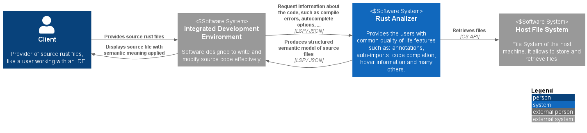
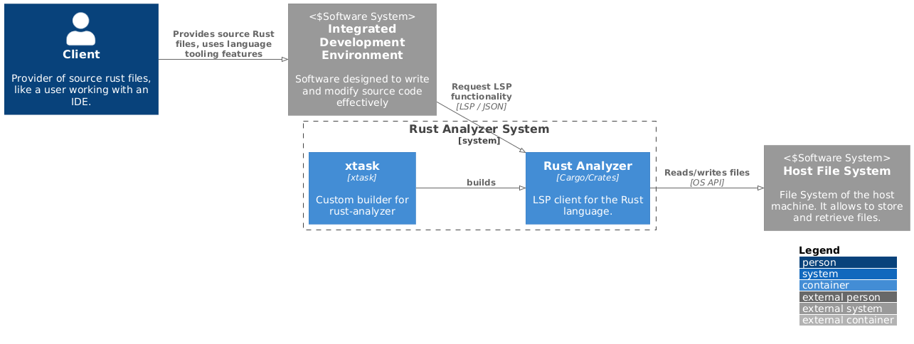
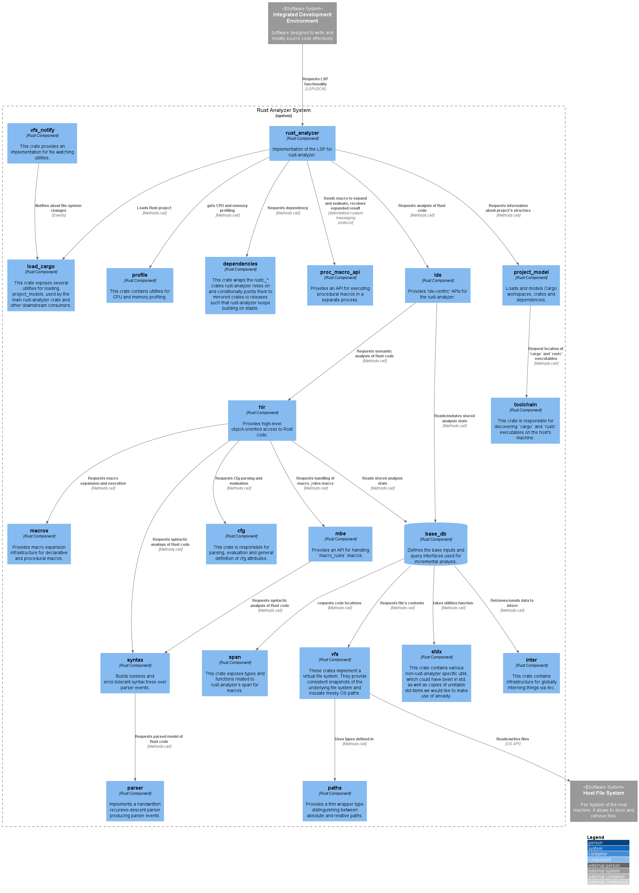

# Architecture
<!--
- Primary goal: document and describe the architecture of the system
- Use C4 notation, provide levels 1-2-3:
    - Declare the tool(s) used for C4 diagram
    - Context diagram
    - Container diagram
    - Components diagrams (motivate decisions if you may need to discard specific containers)
- Tooling
    - https://c4model.com/tooling
    - indicate what you used in the report
- Max 2500 words, excluding diagrams
-->

## Introduction
Rust Analyzer can be though of as a collection of libraries working together to provide a structured syntactic and semantic analysis of rust source code.

As such, Rust Analyzer can be used in many ways by many users.
For instance, one project may wish to import the crate `syntax` to obtain both an abstract and concrete syntax tree (AST and CST respectively) of some piece of rust code.
While another project may use the crate `hir` to derive semantic meaning from a valid AST generated through the `syntax` crate. Yet another project may wish to interact directly with Rust Analyzer through the LSP protocol to obtain IDE level features.

In this analysis we focused our attention on what is probably the most common use case for Rust Analyzer: a user interacting with Rust Analyzer through an IDE to obtain language tooling features (such as code completion, type checking, error checking, goto-definitions, … ).

These different use cases, however, are visible in Rust Analyzer's loosely layered architecture. Each layer exposes a clear API boundary and builds on top of lower level abstractions. This way a user can choose to use individual components in isolation or combine them to obtain progressively higher level analysis of rust code.

## Context level
<!--
- Context level: diagram and explanations
-->

As mentioned in the introduction, Rust Analyzer's core workflow consists of a user asking its IDE for some language tooling feature. The IDE then forwards this request to Rust Analyzer using the LSP protocol.

 

> "The Language Server Protocol (LSP) is an open, JSON-RPC-based protocol for use between source-code editors or integrated development environments (IDEs) and servers that provide 'language intelligence tools'. The goal of the protocol is to allow programming language support to be implemented and distributed independently of any given editor or IDE."
> 
> \- *Wikipedia*

***

## Container Level
<!--
- Container level: diagram and explanations
    * Did you find any relationship with the Clean Architecture blueprint?
-->

 

***

## Component Level
<!--
- Component level: diagrams and explanations
    * Did you observe any violation of SOLID principles at level 3 ?
-->
 
 

***

## Architectural characteristics
<!--
- Architectural characteristics: comment on important architectural characteristics/qualities of the system and how they are supported by the architecture
    * You might also use components coupling and cohesion metrics to support your reasoning
-->

