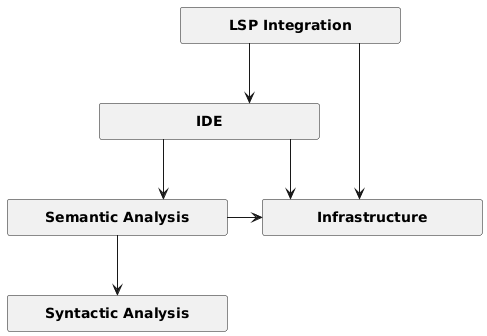

# Architecture
<!--
- Primary goal: document and describe the architecture of the system
- Use C4 notation, provide levels 1-2-3:
    - Declare the tool(s) used for C4 diagram
    - Context diagram
    - Container diagram
    - Components diagrams (motivate decisions if you may need to discard specific containers)
- Tooling
    - https://c4model.com/tooling
    - indicate what you used in the report
- Max 2500 words, excluding diagrams
-->

## Introduction
Rust Analyzer can be though of as a collection of libraries working together to provide a structured syntactic and semantic analysis of rust source code.

As such, Rust Analyzer can be used in many ways by many users.
For instance, one project may wish to import the crate `syntax` to obtain both an abstract and concrete syntax tree (AST and CST respectively) of some piece of rust code.
While another project may use the crate `hir` to derive semantic meaning from a valid AST generated through the `syntax` crate. Yet another project may wish to interact directly with Rust Analyzer through the LSP protocol to obtain IDE level features.

In this analysis we focused our attention on what is probably the most common use case for Rust Analyzer: a user interacting with Rust Analyzer through an IDE to obtain language tooling features (such as code completion, type checking, error checking, goto-definitions, … ).

These different use cases, however, are visible in Rust Analyzer's loosely layered architecture. Each layer exposes a clear API boundary and builds on top of lower level abstractions. This way a user can choose to use individual components in isolation or combine them to obtain progressively higher level analysis of rust code.

## Context level
<!--
- Context level: diagram and explanations
-->

As mentioned in the introduction, Rust Analyzer's core workflow consists of a user asking its IDE for some language tooling feature. The IDE then forwards this request to Rust Analyzer using the LSP protocol.

<figure>
    

        
        <figcaption><em>Figure 1.1: System context diagram</em></figcaption>
    

</figure>

> "The Language Server Protocol (LSP) is an open, JSON-RPC-based protocol for use between source-code editors or integrated development environments (IDEs) and servers that provide 'language intelligence tools'. The goal of the protocol is to allow programming language support to be implemented and distributed independently of any given editor or IDE."
> 
> \- *Wikipedia*

***

## Container Level
<!--
- Container level: diagram and explanations
    * Did you find any relationship with the Clean Architecture blueprint?

Salsa apparently shouldn't be considered a container, as it's not a database running as a separate process, but rather a logical component that implements incremental persistance.
-->

At the container level Rust Analyzer's layered architecture is not yet visible, though some of the most important entities start to emerge.

The external IDE interacts directly with the language server exposed by Rust Analyzer's single deployed container.

<figure>
    

        
        <figcaption><em>Figure 2.1: Container diagram</em></figcaption>
    

</figure>

Though omitted in the diagram, as it doesn't concern the runtime system, at development/installation time, another container becomes relevant:
`xtask` is Rust Analyzer's custom build tool; it is able to produce different types of Rust Analyzer binaries, and it's used extensively in development to produce builds with different characteristics (testing, profiling, …).

As Rust Analyzer is a single deployable unit, the clean architecture blueprint is not yet clearly visible at this level of abstraction.
Rust Analyzer's designers were clearly aware of "clean code" and "clean architecture" approaches as it will become evident in the next section.

***

## Component Level
<!--
- Component level: diagrams and explanations
    * Did you observe any violation of SOLID principles at level 3 ?
-->

At a high level, Rust Analyzer is structured in a loosely layered way, as shown in the figure 3.1.
The analysis starts when the client requests some type of analysis through the LSP protocol.
The LSP layer than forwards this request to the `IDE` layer. 
Then `IDE` layer asks the lower levels to provide the actual analysis of the code:
the syntactic layer, parses the text and generates a valid CST of the provided source files.
Then, the semantic layer takes the CST input and applies semantical meaning to it: mapping syntax nodes to logical concepts. 

<figure align="center">
        
        <figcaption><em>Figure 3.1: Rust's Analizer layered architecture</em></figcaption>
</figure>

<figure align="center">
        
        <figcaption><em>Figure 3.2: Component diagram</em></figcaption>
</figure>

***

## Architectural characteristics
<!--
- Architectural characteristics: comment on important architectural characteristics/qualities of the system and how they are supported by the architecture
    * You might also use components coupling and cohesion metrics to support your reasoning
-->

***
# Architectural notes
These are some of my personal notes on how some components work, taken mostly from this [palylist](https://www.youtube.com/playlist?list=PLhb66M_x9UmrqXhQuIpWC5VgTdrGxMx3y):

## VFS + Paths
Rust Analyzer uses a virtual file system to abstract away how files are acutally stored in the file system.
This is done for several reasons:
1. Rust Analyzer, to avoid occupying too much memory, has to be able to create derived data, forget about it and then recompute it again. If Rust Analyzer simply relied on multiple reads of the same file, there would likely be inconsistencies across multiple reads.
2. Rust Analyzer wants to be *platform-agnostic*, it should be able to work regardless of the underlaying file system used by the OS.
3. On a similar vain, Rust Analyzer would also like to be able to support Multi-file system works (for example, projects written on a Windows machine, but analysed on a separate linux server).

For Rust Analyzer is much simpler to create an internal representation of files as text snapshots indexed by `FileId`, removing direct dependence on OS paths and file system semantics.

To achieve this, files are stored identified not by their paths, but through an id, called `FileId`. 

> **Architecture Invariant** 
> Using IDs to identify files has another important consequence: it makes it very hard to go from a `FileId` to an actual file on the OS file system.
> This makes it easier to avoid mistakes where a developer accidentally reads a file directly and causes problems.
> This way, access to files happens strictly through the *virtual file system*.  
>
> This trend is visible throughout this whole component, file system specific information is systematically erased and only the virtual representation is available to the rest of the project.

> **Architecture Invariant**
> VFS doesn't perform any IO directly and doesn't load or read files, its job is only to record state. The VFS is only populated via the method `set_file_contents`, which intern updates the `changes` array.
>
> This is similar to the architectural pattern called _event sourcing_ used in microservices: each event (deleted, created, modified) is recorded and then used to rebuild from scratch the actual content of the file.
>
> It's instead `loader.rs` job to perform the actual read of the file. It is both able to read files and detect when they have been changed (and emit the associated events). The 'watching' functionality is a non-trivial problem to solve, as most raw OS APIs don't offer a reliable mechanism to detect changes. The crate `vfs_notify` is an implementation of `loader::Handle` and implements the file watching function.
>
> The file watching bits here are untested and quite probably buggy. For this reason, by default Rust Analyzer doesn't watch files and relies on editor’s file watching capabilities instead.

`FileSet` is a special module that allows VFS to be split into "chunks" that roughly correspond to single crate. This is quite useful because it allows to prevent the propagation of changes across the whole VFS, thus help limit recomputation by grouping related files. 

## IDE crate
Main facade for the language server. It provides a stable, query-based API over the semantic layer. It also converts reach semantic data structures used internally into simpler data structures which can be more easily serialized. 

> **Architecture Invariant**
> This crate acts as an **API boundary** between the IDE functions and the underlaying semantic representation of rust code.  

This crate internally is divided into two main subcomponents.

The `AnalysisHost` component is an abstraction used to store the current state of the analysis. It holds the mutable salsa database. Its state changes only through the invocation of a method called `apply_change`.

In this context, a `Change` represents a batch of updates to the database inputs, including file contents, source roots, and the crate graph. 

`AnalysisHost` produces `Analysis` values, which are immutable snapshots of the database at a specific point in time. These snapshots allow concurrent read access to the analysis.

> **Architecture Invariant** 
> `Analysis` provides a consistent view of the world at a moment in time. Multiple `Analysis` instances can coexist and be used concurrently. When `AnalysisHost::apply_change` is invoked, the database is updated and previously in-flight computations may be cancelled, ensuring that outdated results do not propagate.

