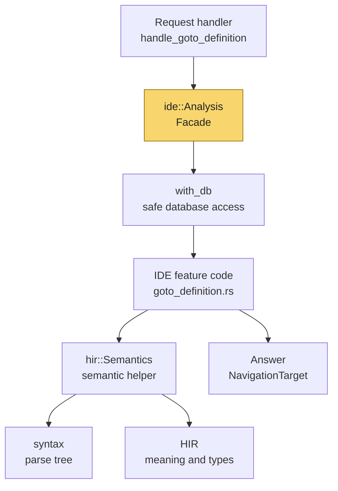
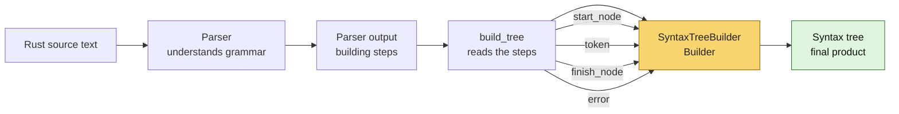
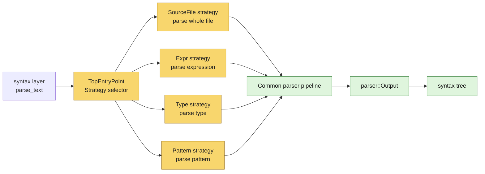

## Code Dependencies

### Methodology and Tools
To analyze dependencies across the `rust-analyzer` workspace, we utilized **`cargo-modules`** to extract AST-aware `.dot` graphs and developed a [custom Node.js script](../../tools/analyze-dependencies.js) to process the data workspace-wide. `std` and external crates are excluded to strictly measure internal system coupling.

### Architectural Validation
During our initial system modeling, we visually hypothesized that the primary execution spine of the system flows sequentially through specific core components:
**Rust Analyzer ➔ Ide ➔ Hir ➔ Syntax ➔ Parser**
<figure align="center">
        
        <figcaption><em>Component diagram</em></figcaption>
</figure>

Following this visual design, we intentionally focused our analytical efforts on this pipeline. The subsequent automated dependency extraction perfectly validated this hypothesis. The calculated metrics proved that these specific crates act as the absolute backbone of the system, exhibiting the highest Fan-In and Fan-Out values.

### Results and Analysis (Fan-In / Fan-Out)

We evaluated the architectural coupling using standard metrics: **Fan-Out** and **Fan-In**. The top 5 results for each category across the entire workspace are detailed below:

| Metric | Component Path | Score |
| :--- | :--- | :--- |
| **Highest Fan-Out**<br>*(Most Dependent)* | `syntax::ast::make::ext`<br>`hir` *(root / lib.rs)*<br>`ide` *(root / lib.rs)*<br>`hir_ty::infer`<br>`hir::semantics` | 154 dependencies<br>119 dependencies<br>74 dependencies<br>71 dependencies<br>67 dependencies |
| **Lowest Fan-Out**<br>*(Most Independent)* | `edition`<br>`syntax::syntax_error`<br>`base_db::all_crates`<br>`base_db::set_all_crates_with_durability`<br>`intern::symbol` | 0 dependencies<br>0 dependencies<br>0 dependencies<br>0 dependencies<br>0 dependencies |
| **Highest Fan-In**<br>*(System Core)* | `syntax::ast::generated::nodes`<br>`syntax::syntax_node`<br>`ide_db` *(root / lib.rs)*<br>`parser::syntax_kind::generated`<br>`hir::semantics` | 1367 times<br>1121 times<br>889 times<br>670 times<br>643 times |
| **Lowest Fan-In**<br>*(Rarely Imported)* | `base_db::change::file_text_durability`<br>`base_db::change::source_root_durability`<br>`cfg::cfg_expr::next_cfg_expr`<br>`cfg::dnf::distribute_conj`<br>`cfg::dnf::flatten` | 0 times<br>0 times<br>0 times<br>0 times<br>0 times |

*(For more details, refer to: [Crate-Level Dependency Report](../../res/crate-level-dependencies.txt) and [Global System Dependency Report](../../res/global-dependencies.txt)).*

## GoF Design Patterns

This section explains 4 GoF design patterns found in the path:

```text
rust-analyzer -> ide -> hir -> syntax -> parser
```

## What Is Happening In This Codebase?

`rust-analyzer` is the program that helps an editor understand Rust code.

For example, when you click **Go to Definition**, the editor asks:

```text
In this file, at this line and column, what does this name mean?
```

rust-analyzer then has to:

1. Receive the editor request.
2. Convert the editor's file/position format into rust-analyzer's internal format.
3. Analyze the Rust code.
4. Parse the source code into a tree.
5. Walk through that tree and semantic information.
6. Convert the final answer back into editor format.

The design patterns appear in this journey.

## Glossary

- **Editor / LSP client:** VS Code, Vim, etc. The editor sends requests to rust-analyzer.
- **LSP:** Language Server Protocol. It is the message format used between editor and language server.
- **FileId:** rust-analyzer's internal numeric ID for a file.
- **TextRange / offset:** rust-analyzer's internal way to point to exact text locations.
- **Syntax tree:** A tree version of source code. For example, a function contains a name, parameters, and a body.
- **Parser:** The part that reads raw source text and discovers its structure.
- **HIR:** A higher-level understanding of code, such as "this name refers to this function" or "this expression has this type".
- **IDE layer:** The layer that answers editor questions such as hover, completion, and go-to-definition.

## Big Picture Flow

```mermaid
flowchart LR
    Editor["Editor<br/>asks: Go to Definition"]
    LspRequest["LSP request<br/>file URL + line/column"]
    AdapterIn["Adapter<br/>from_proto"]
    InternalPosition["Internal position<br/>FileId + offset"]
    Facade["Facade<br/>ide::Analysis"]
    Parser["Parser + Syntax layer<br/>build syntax tree"]
    Hir["HIR / semantic analysis<br/>understand meaning"]
    Result["Internal result<br/>NavigationTarget"]
    AdapterOut["Adapter<br/>to_proto"]
    LspResponse["LSP response<br/>editor can jump there"]

    Editor --> LspRequest --> AdapterIn --> InternalPosition --> Facade --> Parser --> Hir --> Result --> AdapterOut --> LspResponse --> Editor

    classDef pattern fill:#f8d66d,stroke:#9a6b00,color:#222;
    class AdapterIn,AdapterOut,Facade pattern;
```



---

# 1. Adapter - Structural

An **Adapter** converts one format into another format.

```mermaid
flowchart LR
    Editor["Editor"]
    LspParams["LSP params<br/>URL + line/column"]
    Handler["handle_goto_definition"]
    FromProto["from_proto::file_position<br/>Adapter"]
    InternalPos["FilePosition<br/>FileId + offset"]
    Analysis["ide::Analysis::goto_definition"]
    NavTarget["NavigationTarget<br/>internal answer"]
    ToProto["to_proto::goto_definition_response<br/>Adapter"]
    LspResult["LSP response<br/>Location / LocationLink"]

    Editor --> LspParams --> Handler --> FromProto --> InternalPos --> Analysis --> NavTarget --> ToProto --> LspResult --> Editor

    classDef adapter fill:#f8d66d,stroke:#9a6b00,color:#222;
    class FromProto,ToProto adapter;
```



```text
The editor uses LSP positions.
rust-analyzer uses internal FileId + offset positions.
Adapter code converts between them.
```

## Location

- `crates/rust-analyzer/src/handlers/request.rs`
  - `handle_goto_definition`
- `crates/rust-analyzer/src/lsp/from_proto.rs`
  - `file_position`
  - `file_range`
  - `offset`
  - `text_range`
- `crates/rust-analyzer/src/lsp/to_proto.rs`
  - `range`
  - `goto_definition_response`
  - `location_info`

## Execution Trace And Proof

For **Go to Definition**:

1. The editor sends a request like:

   ```text
   file URL: file:///project/src/main.rs
   line: 20
   column: 15
   ```

2. The request reaches `handle_goto_definition`.

3. That handler calls:

   ```text
   from_proto::file_position(...)
   ```

4. `from_proto::file_position` converts editor data into internal data:

   ```text
   LSP file URL + line/column ---Becomes---> FileId + exact text offset
   ```

5. rust-analyzer can now call:

   ```text
   snap.analysis.goto_definition(...)
   ```

6. The result is internal rust-analyzer data, such as `NavigationTarget`.

7. Before sending the answer back, rust-analyzer calls:

   ```text
   to_proto::goto_definition_response(...)
   ```

8. That converts the internal answer back into LSP data the editor understands.

This proves Adapter because `from_proto` and `to_proto` sit between two incompatible interfaces and translate both directions.

## Role Mapping

- **Client:** request handlers like `handle_goto_definition`.
- **Adaptee:** LSP types, such as `lsp_types::Position` and `lsp_types::Range`.
- **Target:** rust-analyzer internal types, such as `FilePosition`, `FileRange`, and `TextRange`.
- **Adapter:** `from_proto` and `to_proto`.

## Problem Solved And Alternatives

Why this is useful:

- The editor and rust-analyzer use different data formats.
- Adapter keeps editor-specific LSP details out of the analysis engine.

Alternative:

```text
Pass LSP types directly into the analysis engine.
```

Pros:

- Less conversion code.

Cons:

- The analysis engine becomes tightly coupled to LSP.
- Harder to reuse analysis outside an editor.

---

# 2. Facade - Structural

A **Facade** gives a simple front door to a complicated system.



```text
The request handler asks ide::Analysis a simple question:
"Where is the definition?"

ide::Analysis hides parsing, semantic analysis, database queries, and cancellation.
```

## Location

Important files and names:

- `crates/rust-analyzer/src/handlers/request.rs`
  - `handle_goto_definition`
- `crates/ide/src/lib.rs`
  - `AnalysisHost`
  - `Analysis`
  - `AnalysisHost::analysis`
  - `Analysis::goto_definition`
  - `Analysis::with_db`
- `crates/ide/src/goto_definition.rs`
  - `goto_definition`
- `crates/hir/src/semantics.rs`
  - `Semantics`
  - `Semantics::parse_guess_edition`
  - `Semantics::type_of_expr`

## Execution Trace And Proof

For **Go to Definition**:

1. `handle_goto_definition` receives the editor request.

2. It converts the position using Adapter code.

3. Then it calls the simple facade method:

   ```text
   snap.analysis.goto_definition(position, &config)
   ```

4. Instead of manually parsing files, resolving names, and running type inference, the handler relies on `ide::Analysis` to hide all that complexity.

This proves Facade because `ide::Analysis` is the simple public object that hides many subsystems.

## Role Mapping

- **Facade:** `ide::Analysis`.
- **Facade owner:** `AnalysisHost`, which stores the current analysis state.
- **Subsystems hidden by the facade:**
  - `RootDatabase`
  - `hir::Semantics`
  - syntax parsing
  - HIR name resolution
  - type inference
  - feature modules like `goto_definition.rs`
- **Client:** request handlers in `rust-analyzer`.

## Problem Solved And Alternatives

Why this is useful:

- Request handlers stay small.
- Complex analysis logic stays inside `ide` and `hir`.
- The server has one clear place to ask IDE questions.

Alternative:

```text
Every request handler directly calls parser, syntax, HIR, and database APIs.
```

Pros:

- Fewer wrapper methods.

Cons:

- Request handlers become very complicated.
- Logic is duplicated across features.
- Harder to change internal analysis later.

---
# 3. Builder - Creational

A **Builder** constructs a complex object step by step.



```text
The parser produces steps.
SyntaxTreeBuilder follows those steps.
At the end, rust-analyzer gets a syntax tree.
```

## Location

Important files and names:

- `crates/hir/src/semantics.rs`
  - `Semantics::parse_guess_edition`
- `crates/syntax/src/lib.rs`
  - `SourceFile::parse`
  - `Parse<SourceFile>`
- `crates/syntax/src/parsing.rs`
  - `parse_text`
  - `parse_text_at`
  - `build_tree`
- `crates/syntax/src/syntax_node.rs`
  - `SyntaxTreeBuilder`
  - `SyntaxTreeBuilder::token`
  - `SyntaxTreeBuilder::start_node`
  - `SyntaxTreeBuilder::finish_node`
  - `SyntaxTreeBuilder::error`
  - `SyntaxTreeBuilder::finish_raw`
- `crates/parser/src/lib.rs`
  - `TopEntryPoint`
  - `TopEntryPoint::parse`
- `crates/parser/src/output.rs`
  - `Output`
  - `Step`
  - `Output::iter`

## Execution Trace And Proof

Imagine the source code:

```rust
fn main() {
    println!("hi");
}
```

rust-analyzer needs to turn this plain text into a syntax tree.

The flow is:

1. An IDE feature needs to understand a file.

2. It asks `hir::Semantics` to parse the file.

3. Parsing reaches:

   ```text
   SourceFile::parse
   ```

4. `SourceFile::parse` calls:

   ```text
   syntax::parsing::parse_text
   ```

5. The parser reads the text and produces steps, not the final tree directly.

   Example idea:

   ```text
   start function node
   add token "fn"
   add token "main"
   start block node
   add token "println"
   finish block node
   finish function node
   ```

6. `syntax::parsing::build_tree` reads those steps.

7. `build_tree` calls `SyntaxTreeBuilder` methods:

   ```text
   start_node(...)
   token(...)
   finish_node(...)
   error(...)
   ```

8. `SyntaxTreeBuilder` builds the final syntax tree.

This proves Builder because a complex object, the syntax tree, is constructed through a sequence of controlled building steps.

## Role Mapping

- **Product:** the final syntax tree, stored as `GreenNode` and wrapped in `Parse<SourceFile>`.
- **Builder:** `SyntaxTreeBuilder`.
- **Director:** `build_tree`, because it decides how to use the builder steps.
- **Step list:** `parser::Output` and `parser::Step`.
- **Client:** `SourceFile::parse`, reached by IDE features through `hir::Semantics`.

## Problem Solved And Alternatives

Why this is useful:

- The parser can focus on grammar.
- The syntax layer can focus on building the tree.
- The parser does not need to know the exact tree-building details.

Alternative:

```text
Make the parser directly create syntax tree nodes.
```

Pros:

- More direct.

Cons:

- Parser becomes tightly coupled to one tree representation.
- Harder to change syntax tree internals later.
- Harder to keep the parser simple.

---

# 4. Strategy - Behavioral

**Strategy** means choosing one algorithm from several possible algorithms.



```text
The parser applies different parsing strategies based on whether it is parsing a complete Rust file, an expression, a type, or a pattern.
```

## Location

Important files and names:

- `crates/syntax/src/parsing.rs`
  - `parse_text`
- `crates/parser/src/lib.rs`
  - `TopEntryPoint`
  - `TopEntryPoint::parse`
- parser grammar functions selected by `TopEntryPoint::parse`
  - `grammar::entry::top::source_file`
  - `grammar::entry::top::expr`
  - `grammar::entry::top::type_`
  - `grammar::entry::top::pattern`
  - `grammar::entry::top::macro_items`

## Execution Trace And Proof

For **Go to Definition**:

1. The editor asks rust-analyzer:

  ```text
  Go to the definition of the symbol at this file position.
  ```

2. The request reaches the LSP handler:

  ```text
  crates/rust-analyzer/src/handlers/request.rs
  handle_goto_definition
  ```

3. The handler converts the editor position into rust-analyzer's internal
  position format.

4. Then the handler calls:

  ```text
  snap.analysis.goto_definition(position, &config)
  ```

5. That enters the `ide` crate:

  ```text
  crates/ide/src/lib.rs
  Analysis::goto_definition
  ```

6. `Analysis::goto_definition` calls the real go-to-definition feature code:

  ```text
  crates/ide/src/goto_definition.rs
  goto_definition(...)
  ```

7. That feature needs to understand the file's syntax, so it uses:

  ```text
  hir::Semantics
  ```

8. Then it parses the current file using:

  ```text
  sema.parse_guess_edition(file_id)
  ```

9. Inside `parse_guess_edition`, rust-analyzer asks the file to parse itself.
  That leads to:

  ```text
  SourceFile::parse
  ```
10. `SourceFile::parse` calls:

  ```text
  syntax::parsing::parse_text
  ```

11. `parse_text` chooses the full-file parser strategy:

  ```text
  TopEntryPoint::SourceFile
  ```

12. Then it calls:

  ```text
  TopEntryPoint::SourceFile.parse(...)
  ```

13. Inside `TopEntryPoint::parse`, the strategy selection happens. The code
  checks which `TopEntryPoint` value it received and chooses the matching
  grammar function:

  ```text
  SourceFile -> grammar::entry::top::source_file
  Expr       -> grammar::entry::top::expr
  Type       -> grammar::entry::top::type_
  Pattern    -> grammar::entry::top::pattern
  ```

14. In this Go-to-Definition trace, the selected strategy is:

  ```text
  grammar::entry::top::source_file
  ```

15. After choosing that function, the rest of the parser pipeline is the same:

  ```text
  create Parser
  run selected grammar function
  finish parser
  produce parser Output
  build syntax tree
  ```

This proves Strategy because `TopEntryPoint::parse` has several possible
parsing algorithms available, and it selects one grammar function based on the
chosen `TopEntryPoint` value.

## Role Mapping

- **Context:** `TopEntryPoint::parse`.
- **Strategy selector:** the `TopEntryPoint` enum.
- **Concrete strategies:**
  - `grammar::entry::top::source_file`
  - `grammar::entry::top::expr`
  - `grammar::entry::top::type_`
  - `grammar::entry::top::pattern`
  - `grammar::entry::top::macro_items`
- **Common input:** `parser::Input`.
- **Common output:** `parser::Output`.
- **Client:** `syntax::parsing::parse_text`.

## Problem Solved And Alternatives

Why this is useful:

- rust-analyzer can reuse one parser framework for many parsing jobs.
- Parsing a full file, an expression, a type, or a pattern follows the same outer process.
- Only the selected grammar function changes.
- This keeps parsing code organized.

Alternative:

```text
Write totally separate parser pipelines:

parse_full_file(...)
parse_expression(...)
parse_type(...)
parse_pattern(...)
```

Pros:

- Each function may look simple by itself.

Cons:

- Much more duplicated parser setup code.
- Harder to guarantee all parser modes behave consistently.
- Harder to add a new parsing mode later.